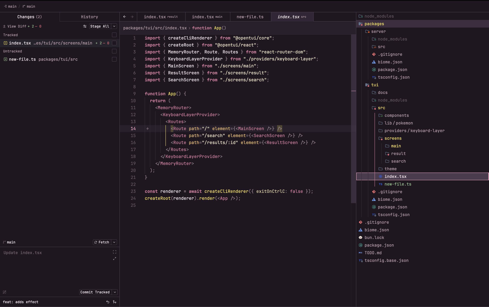

# Galarian Slowpoke Theme

A calm, pastel dark theme for [Zed](https://zed.dev), inspired by Galarian Slowpoke.

## Screenshots

## Installation

### From the Zed Extensions gallery

1. Open Zed.
2. Open the extensions menu (`Cmd+Shift+X`).
3. Search for "Galarian Slowpoke Theme" and install it.
4. Select the theme via Settings → Select Theme.

### Manual install

1. Clone this repository or download the theme file.
2. Copy `themes/g-slowpoke-theme.json` to `~/.config/zed/themes/`.
3. Select the theme (Settings → Select Theme → Galarian Slowpoke Theme).

## License

[MIT](LICENSE)
